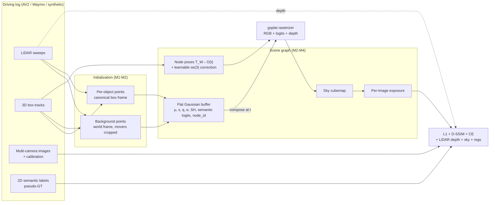

```mermaid
flowchart LR
    subgraph Inputs["Driving log (AV2 / Waymo / synthetic)"]
        L[LiDAR sweeps]
        B[3D box tracks]
        C[Multi-camera images<br/>+ calibration]
        S[2D semantic labels<br/>pseudo-GT]
    end

    subgraph Init["Initialization (M1-M2)"]
        BG["Background points<br/>world frame, movers cropped"]
        OBJ["Per-object points<br/>canonical box frame"]
    end

    subgraph Model["Scene graph (M2-M4)"]
        G["Flat Gaussian buffer<br/>μ, s, q, α, SH, semantic logits, node_id"]
        P["Node poses T_W←O(t)<br/>+ learnable se(3) correction"]
        SKY[Sky cubemap]
        EXP[Per-image exposure]
    end

    R["gsplat rasterizer<br/>RGB + logits + depth"]
    LOSS["L1 + D-SSIM + CE<br/>+ LiDAR depth + sky + regs"]

    L --> BG
    L --> OBJ
    B --> OBJ
    B --> BG
    B --> P
    BG --> G
    OBJ --> G
    G -- "compose at t" --> R
    P --> R
    R --> SKY --> EXP --> LOSS
    C --> LOSS
    S --> LOSS
    L -. depth .-> LOSS
```
